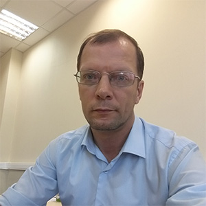

# About project

This site contains information on one of the typical stacks of modern software development technologies. The main technologies included in the described stack: Microservices architecture, Java development, Using Spring and String Boot, Web technologies, Deployment to a container environment, Monitoring. The purpose of the site is to show the full cycle of software development using this stack, with an emphasis on Devops tasks. You can find here: useful best practices, articles, code samples, snippets and references.

History:

The basis for this site was my personal scattered notes that I made while working on various projects in IT. I have similar notes from about 15 years of my last years of work. At some point it became difficult to navigate through them and it was necessary to organize them. I spent some time organizing this. In particular, we had to throw away quite a lot of material that was outdated.

However, I liked the result that I got after this ordering. And I decided that it would be fair to share this result with the IT community. Let there be another Internet resource that may be useful to someone. To increase the usefulness of this resource, I have added some basic definitions to the notes. However, I did not strive to turn each note into a full-fledged and in-depth article on a specific topic. Perhaps this will happen over time, but not yet. However, I tried to compensate for this by including in the notes a large number of links to those Internet resources that I myself often used.

Thus, this site does not pretend to be a programming tutorial, but is a short reference on a typical modern technology stack.  
The site is constantly updated.

About authors:

|---------------------------|-------------------------------------------------------------------------------------------------------------------------------------------------------------------------------------------------------------------------------------------------------|
|  | Hi, I'm Leonid and I'm preparing material for this site. I'm a software developer and architect. Total work experience in the IT industry - 25 years. I was able to gain work experience both in large international companies and in small startups. |
