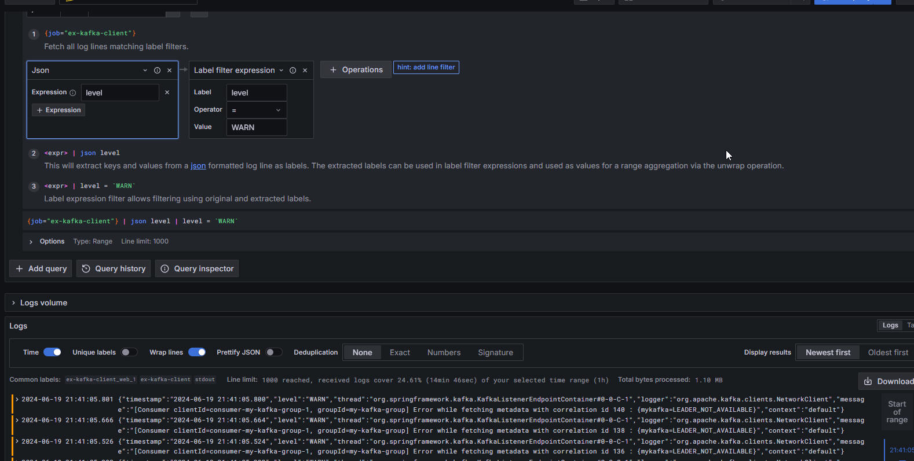
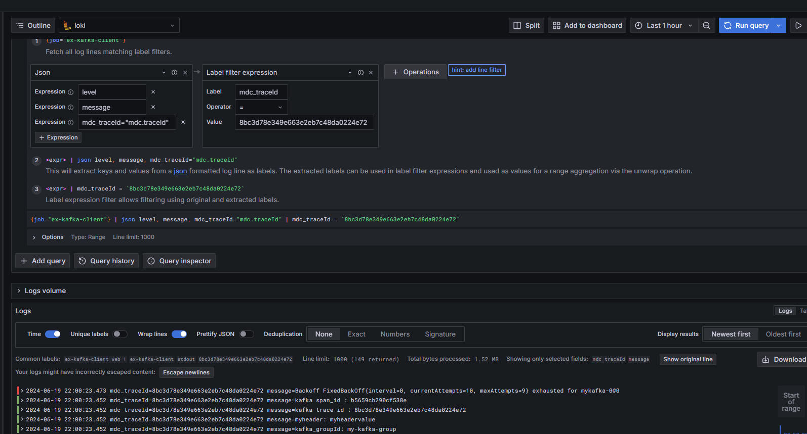
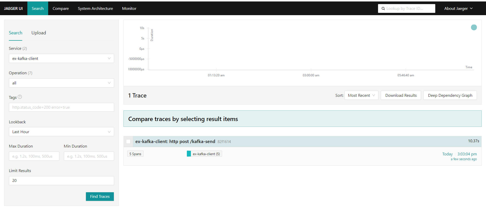
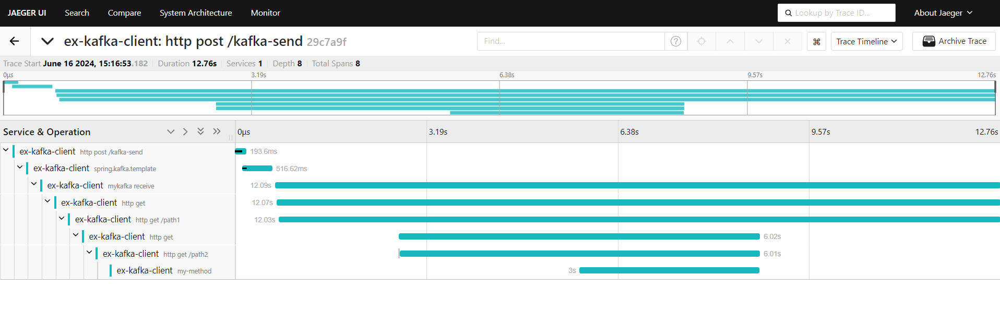
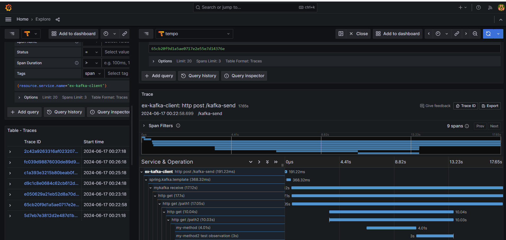


# Logging and tracing

## Overview

Logging is the act of keeping a log of events that occur in a computer system, such as problems, errors or just information on current operations. These events may occur in the operating system or in other software. A message or log entry is recorded for each such event. These log messages can then be used to monitor and understand the operation of the system, to debug problems, or during an audit. Logging is particularly important in multi-user software, to have a central overview of the operation of the system.

In the simplest case, messages are written to a file, called a log file. Alternatively, the messages may be written to a dedicated logging system or to a log management software, where it is stored in a database or on a different computer system. [https://en.wikipedia.org/wiki/Logging\_(computing)](<https://en.wikipedia.org/wiki/Logging_(computing)>)

## Logging in java microservices

Simple log

```java

@Slf4j
public class SomeController  {
	public void someMethod(){
		log.debug("some message");
	}
}
```

Logging with MDC

```java
	meterRegistry.gauge("summer", summer);
	
	MDC.put("trackingNumber", "123456" + (new Date()).getSeconds());
	log.info("test message 3: " + (new Date()).getSeconds());
	MDC.clear();

```

Configuration

Example from application.yaml. Configuration logging from file logback-local.xml, root level is "info", level for classes in package "dionext.com" is "debug"

```yaml
logging:
  config: classpath:${LOGBACK:logback-local.xml}
  level:
    root: info
    com:
      dionext: debug
 
```

Note: `config: classpath:${LOGBACK:logback.xml} - Even if the logger setting is specified in the starter configuration, it must be explicitly specified in the microservice configuration file`

Example of logback.xml for machine logging

```xml

<?xml version="1.0" encoding="UTF-8"?>
<configuration>
    <appender name="STDOUT" class="ch.qos.logback.core.ConsoleAppender">
        <layout class="ch.qos.logback.contrib.json.classic.JsonLayout">
            <jsonFormatter
                    class="ch.qos.logback.contrib.jackson.JacksonJsonFormatter">
            </jsonFormatter>
            <timestampFormat>yyyy-MM-dd' 'HH:mm:ss.SSS</timestampFormat>
            <appendLineSeparator>true</appendLineSeparator>
        </layout>
    </appender>

    <root level="info">
        <appender-ref ref="STDOUT" />
    </root>
</configuration>
```

Example of logback.xml for pretty logging

```xml

<?xml version="1.0" encoding="UTF-8"?>
<configuration>
    <statusListener class="ch.qos.logback.core.status.NopStatusListener" />
    <appender name="STDOUT" class="ch.qos.logback.core.ConsoleAppender">
        <encoder>
            <pattern>%green(%d{HH:mm:ss.SSS}) %yellow([%thread]) %highlight(%-5level) %cyan(%logger{100}) - %msg%n %magenta(%throwable)</pattern>
        </encoder>
    </appender>
    <root level="info">
        <appender-ref ref="STDOUT" />
    </root>
</configuration>
```

If you use actuator you can change log level dynamically via url, for example [http://localhost:8080/api/actuator/loggers/com.dionext](http://localhost:8080/api/actuator/loggers/com.dionext)

[https://www.baeldung.com/spring-boot-changing-log-level-at-runtime](https://www.baeldung.com/spring-boot-changing-log-level-at-runtime)

All loggers status

[http://localhost:8080/actuator/loggers](http://localhost:8080/actuator/loggers)

Viewing and changing log level for "com.dionext"

GET [http://localhost:8080/api/actuator/loggers/com.dionext](http://localhost:8080/api/actuator/loggers/com.dionext)

POST [http://localhost:8080/api/actuator/loggers/com.dionext](http://localhost:8080/api/actuator/loggers/com.dionext)

[http://localhost:8080/api/actuator/loggers/com.dionext](http://localhost:8080/api/actuator/loggers/com.dionext)  
{  
"configuredLevel": "DEBUG"  
}

curl -i -X POST -H 'Content-Type: application/json' -d '{"configuredLevel": "TRACE"}' [http://localhost:8080/api/actuator/loggers/com.dionext](http://localhost:8080/api/actuator/loggers/com.dionext)

Alt

[https://spring.io/blog/2024/08/23/structured-logging-in-spring-boot-3-4](https://spring.io/blog/2024/08/23/structured-logging-in-spring-boot-3-4) Structured logging in Spring Boot 3.4

#### References

[https://www.baeldung.com/java-log-json-output](https://www.baeldung.com/java-log-json-output)

[https://www.baeldung.com/mdc-in-log4j-2-logback](https://www.baeldung.com/mdc-in-log4j-2-logback) MDC

[https://logback.qos.ch/manual/mdc.html#mis](https://logback.qos.ch/manual/mdc.html#mis) MDC

[https://stackoverflow.com/questions/57399354/send-spring-boot-logs-directly-to-logstash-with-no-file](https://stackoverflow.com/questions/57399354/send-spring-boot-logs-directly-to-logstash-with-no-file) log direct to logstash

### Logging with Docker

By default, Docker captures the standard output (and standard error) of all your containers, and writes them in files using the JSON format. The JSON format annotates each line with its origin (stdout or stderr) and its timestamp. Each log file contains information about only one container.

{"log":"Log line is here\\n","stream":"stdout","time":"2019-01-01T11:11:11.111111111Z"}

[https://docs.docker.com/config/containers/logging/json-file/](https://docs.docker.com/config/containers/logging/json-file/)

Docker keeps the json-file logging driver (without log-rotation) as a default to remain backward compatibility with older versions of Docker, and for situations where Docker is used as runtime for Kubernetes. For other situations, the "local" logging driver is recommended as it performs log-rotation by default, and uses a more efficient file format.

Log size restriction

```bash

docker run -it --log-opt max-size=10m --log-opt max-file=3 alpine ash
```

By default java application logs like this:

    2023-06-23T22:32:19.330+03:00 INFO 17740 --- [ scheduling-1] 
    c.f.exmsdemo.scheduler.TestScheduler : test message 3

in docker log file it will be:

```json
{
"log":"2023-06-23T19:48:28.265Z INFO 1 --- [ scheduling-1] c.f.exmsdemo.scheduler.TestScheduler : test message 3\n",
"stream":"stdout",
"time":"2023-06-23T19:48:28.266761249Z"
}
```

If you use special appender you log will be like this:

```json

{
	"level":"INFO",
	"mdc":{"trackingNumber":"12345"},
	"message":"test message 3",
	"thread":"scheduling-1",
	"logger":"com.frwsoftware.exmsdemo.scheduler.TestScheduler",
	"context":"default"
}
```

In Docker it will be:

```json

{
	"log":"{\"timestamp\":\"2023-06-23 20:24:28.523\",\"level\":\"INFO\",\"thread\":\"scheduling-1\",\"mdc\":{\"trackingNumber\":\"xxxxxx\"},\"logger\":\"com.frwsoftware.exmsdemo.scheduler.TestScheduler\",\"message\":\"test message 3\",\"context\":\"default\"}\n",
	"stream":"stdout",
	"time":"2023-06-23T20:24:28.524624217Z"
}
```

(which is more parsable)
To parse this log we can use following configuration in filebeat (ELK):

    filebeat.inputs:
    - type: container
      paths: 
        - '/var/lib/docker/containers/*/*.log'
    
    processors:
    - add_docker_metadata:
        host: "unix:///var/run/docker.sock"
    
    - decode_json_fields:
        fields: ["message"]
        target: "json"
        overwrite_keys: true

#### Docker logging drivers

[https://docs.docker.com/config/containers/logging/configure/#configure-the-logging-driver-for-a-container](https://docs.docker.com/config/containers/logging/configure/#configure-the-logging-driver-for-a-container) Configure logging drivers

Tip: use the local logging driver to prevent disk-exhaustion

[https://www.squadcast.com/blog/docker-compose-logs](https://www.squadcast.com/blog/docker-compose-logs) Docker Compose Logs: Guide \& Best Practices

##### Docker driver for Loki

There are complaints in Internet: when Loki was down as it locked up the entire docker stack.

[https://grafana.com/docs/loki/latest/send-data/docker-driver/configuration/](https://grafana.com/docs/loki/latest/send-data/docker-driver/configuration/) Docker driver for Loki

[https://www.saboit.de/blog/docker-log-plugin-loki-and-docker-container-logging](https://www.saboit.de/blog/docker-log-plugin-loki-and-docker-container-logging) Docker log plugin, Loki and Docker container logging

### Logging SQL

[https://www.baeldung.com/sql-logging-spring-boot](https://www.baeldung.com/sql-logging-spring-boot)

[https://stackoverflow.com/questions/12656452/hibernate-show-query-execution-time](https://stackoverflow.com/questions/12656452/hibernate-show-query-execution-time)

## ELK Stack

[https://www.elastic.co/](https://www.elastic.co/)

The ELK Stack is a collection of three open-source products - Elasticsearch, Logstash, and Kibana. ELK stack provides centralized logging in order to identify problems with servers or applications. It allows you to search all the logs in a single place. It also helps to find issues in multiple servers by connecting logs during a specific time frame [https://www.guru99.com/elk-stack-tutorial.html](https://www.guru99.com/elk-stack-tutorial.html)

### Versions

Versions: last from 7х - 7.17.22, last from 8х - 8.14.1 Note: download from docker.elastic.co ( needs for [https://github.com/deviantony/docker-elk](https://github.com/deviantony/docker-elk) or [https://community.hetzner.com/tutorials/deploy-elk-stack-with-docker](https://community.hetzner.com/tutorials/deploy-elk-stack-with-docker) ) is blocked for some countries

Security is enabled by default since Elasticsearch 8.0, so you will need SSL certificates, and the examples you find online using docker-compose from the Elasticsearch 7.x era will not work. While the Elasticsearch documentation provides an example docker-compose.yml file that includes Elasticsearch and Kibana with certificates, it does not include Filebeat. [https://gigi.nullneuron.net/gigilabs/filebeat-elasticsearch-and-kibana-with-docker-compose/](https://gigi.nullneuron.net/gigilabs/filebeat-elasticsearch-and-kibana-with-docker-compose/)

### Elasticsearch

Elasticsearch is a search engine based on the Lucene library. It provides a distributed, multitenant-capable full-text search engine with an HTTP web interface and schema-free JSON documents. Elasticsearch is developed in Java and is dual-licensed under the source-available Server Side Public License and the Elastic license, while other parts fall under the proprietary (source-available) Elastic License. Official clients are available in Java,.NET (C#), PHP, Python, Rubyand many other languages.According to the DB-Engines ranking, Elasticsearch is the most popular enterprise search engine. [https://en.wikipedia.org/wiki/Elasticsearch](https://en.wikipedia.org/wiki/Elasticsearch)

Removing old logs

You can use curator, a tool that is also developed by [elastic](https://www.elastic.co/), to remove old indices from ElasticSearch. You can install curator by following one of the methods described in the [official documentation](https://www.elastic.co/guide/en/elasticsearch/client/curator/5.x/installation.html).

### Logstash

Logstash is a free and open server-side data processing pipeline that ingests data from a multitude of sources, transforms it, and then sends it to your favorite "stash." [https://www.elastic.co/logstash](https://www.elastic.co/logstash)

Logstash is a tool to collect, process, and forward events and log messages. Collection is accomplished via configurable input plugins including raw socket/packet communication, file tailing, and several message bus clients. Once an input plugin has collected data it can be processed by any number of filters which modify and annotate the event data. Finally logstash routes events to output plugins which can forward the events to a variety of external programs, local files, and several message bus implementations

Here is our configuration file logback.conf:

    input {
        file {
            path => "/var/lib/tomcat8/logback/*.log"
            codec => "json"
            type => "logback"
        }
    }
    
    output {
        if [type]=="logback" {
             elasticsearch {
                 hosts => [ "localhost:9200" ]
                 index => "logback-%{+YYYY.MM.dd}"
            }
        }
    }

* input file is used as Logstash will read logs this time from logging files
* path is set to our logging directory and all files with .log extension will be processed
* index is set to new index "logback-%{+YYYY.MM.dd}" instead of default "logstash-%{+YYYY.MM.dd}"

Example or logging directly to logstash [https://howtodoinjava.com/spring-cloud/elk-stack-tutorial-example/#microservice](https://howtodoinjava.com/spring-cloud/elk-stack-tutorial-example/#microservice)

It is essential to place your pipeline configuration where it can be found by Logstash. By default, the container will look in /usr/share/logstash/pipeline/ for pipeline configuration files.

### Filebeat

[https://www.elastic.co/beats/filebeat](https://www.elastic.co/beats/filebeat)

[https://www.elastic.co/guide/en/beats/filebeat/7.17/running-on-docker.html](https://www.elastic.co/guide/en/beats/filebeat/7.17/running-on-docker.html)

Lightweight shipper for logs. Whether you're collecting from security devices, cloud, containers, hosts, or OT, Filebeat helps you keep the simple things simple by offering a lightweight way to forward and centralize logs and files.

Filebeat is a lightweight log message deliverer. The way it works is to monitor and collect log messages from log files and forward them to Elasticsearch or Logstash for indexing.

Filebeat consists of key components:

* collectors (harvesters) - are responsible for reading log files and sending log messages to a given output interface, a separate collector is specified for each log file;
* input interfaces (inputs) - are responsible for searching for sources of log messages and managing collectors.

Elastic Stack consists of of four components: Elasticsearch, Logstash, Kibana and Beats. The latter is a family of log deliverers for a variety of use cases, and Filebeat is the most popular. In general, the beats family are lightweight, open-source data providers that you install as agents on your servers to send operational data to Elasticsearch. Beats can send data directly to Elasticsearch or through Logstash, where you can further process and enhance the data (image). The beats family consists of Filebeat, Metricbeat, Packetbeat, Winlogbeat, Auditbeat, Journalbeat, Heartbeat and Functionbeat. Each bit is designed to deliver different types of information - for example, Winlogbeat sends Windows event logs, Metricbeat sends host metrics, and so on. Filebeat is designed for sending log files.

[https://www.sarulabs.com/post/5/2019-08-12/sending-docker-logs-to-elasticsearch-and-kibana-with-filebeat.html](https://www.sarulabs.com/post/5/2019-08-12/sending-docker-logs-to-elasticsearch-and-kibana-with-filebeat.html) Docker writes the container logs in files. FileBeat then reads those files and transfer the logs into ElasticSearch. FileBeat is used as a replacement for Logstash. It was created because Logstash requires a JVM and tends to consume a lot of resources. Although FileBeat is simpler than Logstash, you can still do a lot of things with it. There are many ways to install FileBeat, ElasticSearch and Kibana. To make things as simple as possible, we will use docker compose to set them up. We will use the official docker images and there will be a single ElasticSearch node.

[https://www.elastic.co/downloads/beats/filebeat](https://www.elastic.co/downloads/beats/filebeat)

If all your files are located on the same node as the logstash process, than using the File Input Plugin could be an option ("xyzlogfile---\>logstash-file---\>ES---\>kibana").

However for most deployments you want to collect data from many nodes with different roles and software stacks deployed on them. You do not want to deploy a Logstash instance on all those nodes, so "xyzlogfile---\>fileBeat---\>logstash-beats---\>ES---\>kibana" should be used (or another option is "xyzlogfile---\>fileBeat---\>ES---\>kibana" with Ingest Node).

[https://stackoverflow.com/questions/46301058/why-do-we-need-filebeat-when-we-can-ship-logs-to-logstatsh](https://stackoverflow.com/questions/46301058/why-do-we-need-filebeat-when-we-can-ship-logs-to-logstatsh)

```
output.elasticsearch:
  hosts: ["elasticsearch:9200"]
  indices:
    - index: "filebeat-elastic-%{[agent.version]}-%{+yyyy.MM.dd}"
      when.or:
        - equals:
            container.image.name: docker.elastic.co/beats/filebeat:7.2.0
        - equals:
            container.image.name: docker.elastic.co/elasticsearch/elasticsearch:7.2.0
        - equals:
            container.image.name: docker.elastic.co/kibana/kibana:7.2.0
    - index: "filebeat-apps-%{[agent.version]}-%{+yyyy.MM.dd}"
```

```
 
```

{#id11}Decode json fields [https://www.elastic.co/guide/en/beats/filebeat/current/decode-json-fields.html](https://www.elastic.co/guide/en/beats/filebeat/current/decode-json-fields.html)

```
processors:
  - decode_json_fields:
      fields: ["field1", "field2", ...]
      process_array: false
      max_depth: 1
      target: ""
      overwrite_keys: false
      add_error_key: true
```

Example of filebeat configuration

    filebeat.inputs:
    - type: container
      paths: 
        - '/var/lib/docker/containers/*/*.log'
    
    processors:
    - add_docker_metadata:
        host: "unix:///var/run/docker.sock"
    
    - decode_json_fields:
        fields: ["message"]
        target: "json"
        overwrite_keys: true

https://www.elastic.co/guide/en/beats/filebeat/current/filebeat-input-container.html{#id12} Container input

[https://www.elastic.co/guide/en/beats/filebeat/7.17/filebeat-input-docker.html](https://www.elastic.co/guide/en/beats/filebeat/7.17/filebeat-input-docker.html) Docker input (deprecated)

### Kibana

Kibana provides visualization capabilities on top of the content indexed on an Elasticsearch cluster. Users can create bar, line and scatter plots, or pie charts and maps on top of large volumes of data [https://en.wikipedia.org/wiki/Kibana](https://en.wikipedia.org/wiki/Kibana)

Open config/kibana.yml in an editor and set elasticsearch.url to point at your Elasticsearch instance. In our case as we will use the local instance just uncomment elasticsearch.url: "[http://localhost:9200](http://localhost:9200)"

create new index [https://www.elastic.co/guide/en/kibana/7.17/index-patterns.html](https://www.elastic.co/guide/en/kibana/7.17/index-patterns.html)

[https://www.elastic.co/guide/en/kibana/7.8/tutorial-sample-data.html](https://www.elastic.co/guide/en/kibana/7.8/tutorial-sample-data.html)

You can use the filebeat-\*template to include all logs coming from FileBeat. You also need to define the field used as the log timestamp.

### References and examples

[https://github.com/awesome-release/elasticsearch-logstash-kibana](https://github.com/awesome-release/elasticsearch-logstash-kibana) 7.8.0

[https://github.com/amlana21/elkstack-publish.git](https://github.com/amlana21/elkstack-publish.git)

[https://amlanscloud.com/elk\_stack\_2/](https://amlanscloud.com/elk_stack_2/) [https://github.com/shazChaudhry/docker-elastic.git](https://github.com/shazChaudhry/docker-elastic.git)

[https://github.com/deviantony/docker-elk](https://github.com/deviantony/docker-elk)

[https://github.com/barseghyanartur/elk-stack-container-example](https://github.com/barseghyanartur/elk-stack-container-example) 7.16.1 (ветка!)

[https://github.com/sherifabdlnaby/elastdocker.git](https://github.com/sherifabdlnaby/elastdocker.git) \>= 8.0.0

The [https://www.elastic.co/guide/en/elasticsearch/reference/current/docker.html](https://www.elastic.co/guide/en/elasticsearch/reference/current/docker.html) page in the official Elasticsearch documentation is a great starting point for running Elasticsearch with Docker. The [https://www.elastic.co/guide/en/elasticsearch/reference/current/docker.html#docker-compose-file](https://www.elastic.co/guide/en/elasticsearch/reference/current/docker.html#docker-compose-file) section provides everything you need to run a three-node Elasticsearch cluster with Kibana in Docker using docker-compose.

[https://www.baeldung.com/java-application-logs-to-elastic-stack](https://www.baeldung.com/java-application-logs-to-elastic-stack)

## Grafana Loki

Loki is Grafana's log aggregation component. Inspired by Prometheus, it's highly scalable and capable of handling petabytes of log data.

[https://grafana.com/docs/loki/latest/](https://grafana.com/docs/loki/latest/) Documentation

[https://github.com/grafana/loki](https://github.com/grafana/loki) Repo

[https://stackoverflow.com/questions/74568197/grafana-showing-too-many-outstanding-requests-error-while-querying-loki-dashbo](https://stackoverflow.com/questions/74568197/grafana-showing-too-many-outstanding-requests-error-while-querying-loki-dashbo) Grafana showing "too many outstanding requests" error while querying loki dashboard

[https://stackoverflow.com/questions/70831337/how-to-reduce-the-amount-of-chunks-to-prevent-running-out-of-disk-space-for-loki](https://stackoverflow.com/questions/70831337/how-to-reduce-the-amount-of-chunks-to-prevent-running-out-of-disk-space-for-loki) How to reduce the amount of chunks to prevent running out of disk space for Loki/Promtail?

[https://www.baeldung.com/spring-boot-loki-grafana-logging](https://www.baeldung.com/spring-boot-loki-grafana-logging) Logging in Spring Boot With Loki

[https://www.springcloud.io/post/2022-02/springboot-loki-1/#gsc.tab=0](https://www.springcloud.io/post/2022-02/springboot-loki-1/#gsc.tab=0) [https://www.springcloud.io/post/2022-02/springboot-loki-2/#gsc.tab=0](https://www.springcloud.io/post/2022-02/springboot-loki-2/#gsc.tab=0) SpringBoot integration of lightweight logging system loki

[https://dev.to/luafanti/spring-boot-logging-with-loki-promtail-and-grafana-loki-stack-aep](https://dev.to/luafanti/spring-boot-logging-with-loki-promtail-and-grafana-loki-stack-aep) Spring Boot logging with Loki, Promtail, and Grafana (Loki stack)

[https://www.youtube.com/watch?v=0B-yQdSXFJE](https://www.youtube.com/watch?v=0B-yQdSXFJE) Mastering Grafana Loki: Complete Guide to Installation, Configuration, and Integration

### Promtail

Installation

To use docker\_sd\_configs we need install Promtail to the host machine. If we not plan to usedocker\_sd\_configs we can docker image.

[https://psujit775.medium.com/how-to-setup-promtail-in-ubuntu-20-04-ed652b7c47c3](https://psujit775.medium.com/how-to-setup-promtail-in-ubuntu-20-04-ed652b7c47c3) How to setup Promtail in Ubuntu 20.04

[https://grafana.com/docs/loki/latest/setup/install/local/#install-using-apt-or-rpm-package-manager](https://grafana.com/docs/loki/latest/setup/install/local/#install-using-apt-or-rpm-package-manager)

```
curl -O -L "https://github.com/grafana/loki/releases/download/v2.9.8/promtail-linux-amd64.zip"
unzip "promtail-linux-amd64.zip"
chmod a+x "promtail-linux-amd64"
sudo cp promtail-linux-amd64 /usr/local/bin/promtail
```

```
#verify installation by checking version
promtail --version
```

```
sudo mkdir -p /etc/promtail /etc/promtail/logs
```

```
wget https://raw.githubusercontent.com/grafana/loki/main/clients/cmd/promtail/promtail-local-config.yaml
```

```
cp promtail-local-config.yaml  
```

```
/etc/promtail/promtail-config.yaml
```

```
sudo vi /etc/systemd/system/promtail.service
```

```
#edit content 
```

```
sudo systemctl daemon-reload #To reload systemd
sudo systemctl start promtail #to start promtail
sudo systemctl status promtail #to check status
sudo systemctl restart promtail #to restart
```

sudo systemctl enable promtail.service

promtail.service

\[Unit\]  
Description=Promtail service  
After=network.target

\[Service\]  
Type=simple  
User=root  
ExecStart=/usr/local/bin/promtail -config.file /etc/promtail/promtail-config.yaml  
Restart=on-failure  
RestartSec=20  
StandardOutput=append:/etc/promtail/logs/promtail.log  
StandardError=append:/etc/promtail/logs/promtail.log

\[Install\]  
WantedBy=multi-user.target

Configuration

[https://grafana.com/docs/loki/latest/send-data/promtail/configuration/](https://grafana.com/docs/loki/latest/send-data/promtail/configuration/)

Docker service discovery allows retrieving targets from a Docker daemon. It will only watch containers of the Docker daemon referenced with the host parameter. Docker service discovery should run on each node in a distributed setup. The containers must run with either the json-file or journald logging driver.

[https://grafana.com/docs/loki/latest/send-data/promtail/configuration/#docker\_sd\_config](https://grafana.com/docs/loki/latest/send-data/promtail/configuration/#docker_sd_config)

[https://stackoverflow.com/questions/74776432/with-promtail-how-do-i-only-keep-log-messages-for-specified-docker-containers](https://stackoverflow.com/questions/74776432/with-promtail-how-do-i-only-keep-log-messages-for-specified-docker-containers) With Promtail, how do I only keep log messages for specified Docker containers

### Grafana Loki Visualisation

Example of filter by JSON field



[https://grafana.com/docs/loki/latest/query/log\_queries/#json](https://grafana.com/docs/loki/latest/query/log_queries/#json) Example of filter by nested JSON field



## Tracing. Overview

Tracing in software engineering refers to the process of capturing and recording information about the execution of a software program. This information is typically used by programmers for debugging purposes, and additionally, depending on the type and detail of information contained in a trace log, by experienced system administrators or technical-support personnel and by software monitoring tools to diagnose common problems with software. Tracing is a cross-cutting concern. [https://en.wikipedia.org/wiki/Tracing\_(software](<https://en.wikipedia.org/wiki/Tracing_(software>))

## OpenTelemetry

OpenTelemetry is an open source project within the Cloud Native Computing Foundation (CNCF) that offers a unified platform for creating, collecting and communicating telemetry data. With OpenTelemetry, you can instrument your application in a vendor-neutral manner and then analyze the telemetry data in the back-end tool of your choice, be it Prometheus, Jaeger, Zipkin, or others.

[https://opentelemetry.io/](https://opentelemetry.io/) OpenTelemetry is a collection of APIs, SDKs, and tools. Use it to instrument, generate, collect, and export telemetry data (metrics, logs, and traces) to help you analyze your software's performance and behavior.

OpenTelemetry API for java

[https://opentelemetry.io/docs/languages/java/](https://opentelemetry.io/docs/languages/java/)

```
    <dependency>
      <groupId>io.opentelemetry</groupId>
      <artifactId>opentelemetry-api</artifactId>
    </dependency>
```

[https://opentelemetry.io/docs/zero-code/java/spring-boot-starter/](https://opentelemetry.io/docs/zero-code/java/spring-boot-starter/) Spring Boot starter (Note: The default choice for instrumenting Spring Boot applications is the OpenTelemetry Java agent with bytecode instrumentation)

```
<dependencies>
  <dependency>
    <groupId>io.opentelemetry.instrumentation</groupId>
    <artifactId>opentelemetry-spring-boot-starter</artifactId>
  </dependency>
</dependencies>
```

Note: Spring Cloud Sleuth (which can found in many examples) is not planned to work with Spring Boot 3. You must migrate to Micrometer Tracing. [https://stackoverflow.com/questions/75336414/spring-cloud-sleuth-and-spring-boot-3-and-the-english-language](https://stackoverflow.com/questions/75336414/spring-cloud-sleuth-and-spring-boot-3-and-the-english-language)

```html

	 	<dependency>
			<groupId>io.micrometer</groupId>
			<artifactId>micrometer-tracing-bridge-otel</artifactId>
		</dependency>
		<dependency>
			<groupId>io.opentelemetry</groupId>
			<artifactId>opentelemetry-exporter-otlp</artifactId>
		</dependency>
```

The traceparent HTTP header [https://uptrace.dev/opentelemetry/opentelemetry-traceparent.html](https://uptrace.dev/opentelemetry/opentelemetry-traceparent.html) [https://www.w3.org/TR/trace-context/](https://www.w3.org/TR/trace-context/) contains information about the incoming request in a distributed tracing system, for example:

# {version}-{trace\_id}-{span\_id}-{trace\_flags}

traceparent: 00-80e1afed08e019fc1110464cfa66635c-7a085853722dc6d2-01

### Micrometer

[https://micrometer.io/](https://micrometer.io/) Vendor-neutral application observability facade Micrometer provides a facade for the most popular observability systems, allowing you to instrument your JVM-based application code without vendor lock-in. Think SLF4J, but for observability.

You should add a tracing bridge, such as micrometer-tracing-bridge-brave or **micrometer-tracing-bridge-otel** and span exporters / reporters. When you add a bridge, the micrometer-tracing library is added transitively.

### Micrometer API vs Opentelemetry API

OpenTelemetry and Micrometer share some similarities in the sense that they both have metric APIs. (see [https://stackoverflow.com/questions/62602266/where-does-micrometer-fit-in-opentelemetry-project](https://stackoverflow.com/questions/62602266/where-does-micrometer-fit-in-opentelemetry-project) )

Examples for using both APIs

[https://github.com/fstab/jcon-2023](https://github.com/fstab/jcon-2023)

[https://github.com/xsreality/spring-boot-tracing-demo](https://github.com/xsreality/spring-boot-tracing-demo)

### Jaeger

[https://www.jaegertracing.io/](https://www.jaegertracing.io/) Jaeger: open source, distributed tracing platform Monitor and troubleshoot workflows in complex distributed systems

Installation [https://www.jaegertracing.io/docs/1.58/getting-started/](https://www.jaegertracing.io/docs/1.58/getting-started/) **all-in-one** is an executable designed for quick local testing. It includes the Jaeger UI, jaeger-collector, jaeger-query, and jaeger-agent, with an in memory storage component. The simplest way to start the all-in-one is to use the pre-built image published to DockerHub (a single command line).

jaeger-agent is deprecated  . The OpenTelemetry data can be sent from the OpenTelemetry SDKs (equipped with OTLP exporters) directly to jaeger-collector. Alternatively, use the OpenTelemetry Collector as a local agent.



Example trace:



## Grafana Tempo

[https://grafana.com/docs/tempo/latest/getting-started/](https://grafana.com/docs/tempo/latest/getting-started/)

Grafana Tempo is an open source, easy-to-use, and high-scale distributed tracing backend. Tempo lets you search for traces, generate metrics from spans, and link your tracing data with logs and metrics.



## References

[https://www.youtube.com/watch?v=Hink0jF8c28](https://www.youtube.com/watch?v=Hink0jF8c28) OpenTelemetry for Java Developers | Fabian Stäber (EN)

[https://medium.com/cloud-native-daily/how-to-send-traces-from-spring-boot-to-jaeger-229c19f544db](https://medium.com/cloud-native-daily/how-to-send-traces-from-spring-boot-to-jaeger-229c19f544db) How to Send Traces from Spring Boot to Jaeger

[https://www.baeldung.com/spring-boot-opentelemetry-setup](https://www.baeldung.com/spring-boot-opentelemetry-setup) OpenTelemetry Setup in Spring Boot Application (sleuth)

[https://github.com/micrometer-metrics/micrometer-samples](https://github.com/micrometer-metrics/micrometer-samples) Sample apps to demo Micrometer features. (official)

[https://www.baeldung.com/micrometer](https://www.baeldung.com/micrometer) Quick Guide to Micrometer

[https://www.youtube.com/watch?v=XHexyDqa\_S0\&list=PL6VBQyIvTlRiuL9yRTigwtWIWCgrZTwtt](https://www.youtube.com/watch?v=XHexyDqa_S0&list=PL6VBQyIvTlRiuL9yRTigwtWIWCgrZTwtt) Collecting and Analyzing Logs ("Is it Observable" playlist)
