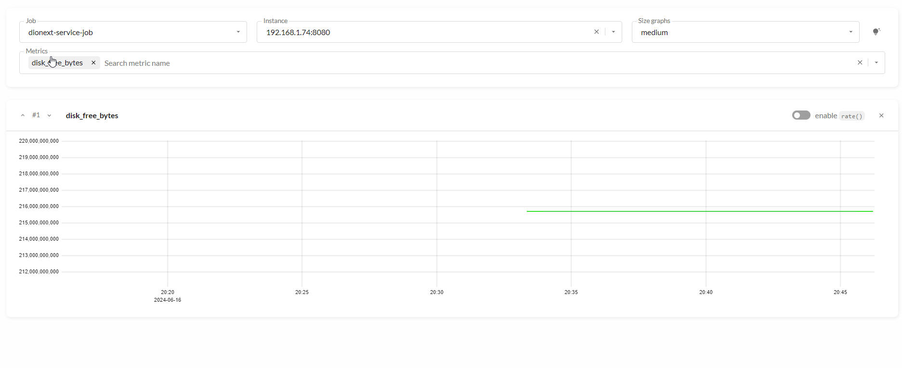


# Devops. Monitoring

## Overview

[https://en.wikipedia.org/wiki/Monitoring](https://en.wikipedia.org/wiki/Monitoring)

* [Application performance management](https://en.wikipedia.org/wiki/Application_performance_management "Application performance management"), also called application performance monitoring, monitoring and management of performance and availability of software applications
* [Event monitoring](https://en.wikipedia.org/wiki/Event_monitoring "Event monitoring"), process of collecting, analyzing, and signaling event occurrences to subscribers such as operating system processes, active database rules as well as human operators
* [Business transaction management](https://en.wikipedia.org/wiki/Business_transaction_management "Business transaction management"), also called business transaction monitoring, managing information technology from a business transaction perspective
* [Network monitoring](https://en.wikipedia.org/wiki/Network_monitoring "Network monitoring"), systems that constantly monitors a computer network for slow or failing components and that notifies the network administrator
* [System monitoring](https://en.wikipedia.org/wiki/System_monitoring "System monitoring"), a process within a distributed system for collecting and storing state data
* [User activity monitoring](https://en.wikipedia.org/wiki/User_activity_monitoring "User activity monitoring"), the process of recording user input
* [Website monitoring](https://en.wikipedia.org/wiki/Website_monitoring "Website monitoring"), the process of testing and verifying that end-users can interact with a website or web application as expected

Simple Monitoring with Linux cmd

free -m

[https://www.linuxatemyram.com/](https://www.linuxatemyram.com/) To see how much ram your applications could use without swapping, run free -m and look at the **"available**" column (On installations from before 2016, look at "free" column in the "-/+ buffers/cache" row instead.)
When should I start to worry?

A healthy Linux system with more than enough memory will, after running for a while, show the following expected and harmless behavior:

* free memory is close to 0
* used memory is close to total
* available memory (or "free + buffers/cache") has enough room (let's say, 20%+ of total)
* swap used does not change

Warning signs of a genuine low memory situation that you may want to look into:

* available memory (or "free + buffers/cache") is close to zero
* swap used increases or fluctuates
* dmesg | grep oom-killer shows the OutOfMemory-killer at work

df -h

docker system df

docker stats

With the docker system df command you would get a summary of your Docker usage including things like:

* The total size of all images
* The total size of all containers
* The local volumes size
* And the cache

du -hs /var/lib/docker  
du -hs /var/lib/docker/containers  
du -hs /var/lib/docker/overlay2  
du -hs /var/lib/docker/volumes

For example:

du -hs /var/lib/docker/volumes/elk\_elasticsearch  
du -hs /var/lib/docker/volumes/monitoring\_loki-data

[https://docs.docker.com/config/containers/resource\_constraints/#understand-the-risks-of-running-out-of-memory](https://docs.docker.com/config/containers/resource_constraints/#understand-the-risks-of-running-out-of-memory)

## Monitoring system with Prometheus and Grafana

### Prometheus

[https://prometheus.io/](https://prometheus.io/)

Prometheus is a free software application used for event monitoring and alerting. It records metrics in a time series database (allowing for high dimensionality) built using an HTTP pull model, with flexible queries and real-time alerting. The project is written in Go and licensed under the Apache 2 License, with source code available on GitHub, and is a graduated project of the Cloud Native Computing Foundation, along with Kubernetes and Envoy. [https://en.wikipedia.org/wiki/Prometheus\_(software](<https://en.wikipedia.org/wiki/Prometheus_(software>))

[https://github.com/prometheus/client\_java](https://github.com/prometheus/client_java) examples for java

[https://hub.docker.com/r/prom/prometheus/](https://hub.docker.com/r/prom/prometheus/) official docker image

[https://docs.docker.com/config/daemon/prometheus/](https://docs.docker.com/config/daemon/prometheus/) Collect Docker metrics with Prometheus

### Exporters (for Prometheus)

[https://prometheus.io/docs/instrumenting/exporters/](https://prometheus.io/docs/instrumenting/exporters/)

Some of the most popular exporters:

* node\_exporter collects infrastructure metrics including CPU, memory and disk usage, as well as I/O and network statistics (such as the number of bytes read from disk or average server load).
* The WMI exporter is recommended for Windows users.
* blackbox\_exporter generates metrics derived from protocols such as HTTP and HTTPS to determine endpoint availability, response times, etc.
* mysqld\_exporter collects metrics related to the MySQL server, such as the number of queries executed , average response time and cluster replication status.
* rabbitmq\_exporter gathers metrics about the RabbitMQ messaging system, including the number of messages published, the number of messages ready to be sent, and the size of all messages in the queue.
* nginx-vts-exporter gathers metrics about the Nginx web server using the module Nginx VTS, including the number of open connections, the number of responses sent (grouped by response codes), and the total size of requests sent or received in bytes.

#### Exporter for windows

[https://www.devopsschool.com/blog/how-to-install-windows-exporter-for-prometheus/](https://www.devopsschool.com/blog/how-to-install-windows-exporter-for-prometheus/)

You can view metrics on [http://yourhost:9182/metrics](http://yourhost:9182/metrics)

Configuration in Prometheus (example for two hosts 192.168.1.74 and 192.168.1.75) :

- job\_name: "windows\_exporter"  
  static\_configs:
- targets: \["192.168.1.74:9182", "192.168.1.75:9182"\]

Dashboard for Grafana

[https://grafana.com/grafana/dashboards/14694-windows-exporter-dashboard/](https://grafana.com/grafana/dashboards/14694-windows-exporter-dashboard/) ID: 14694

#### Node exporter

[https://github.com/prometheus/node\_exporter](https://github.com/prometheus/node_exporter)

Installation for Linux [https://www.fosstechnix.com/install-prometheus-node-exporter-on-linux/](https://www.fosstechnix.com/install-prometheus-node-exporter-on-linux/)

#### cAdvisor

[https://github.com/google/cadvisor](https://github.com/google/cadvisor) cAdvisor (Container Advisor) provides container users an understanding of the resource usage and performance characteristics of their running containers. It is a running daemon that collects, aggregates, processes, and exports information about running containers. Specifically, for each container it keeps resource isolation parameters, historical resource usage, histograms of complete historical resource usage and network statistics. This data is exported by container and machine-wide.

```
docker run \
  --volume=/:/rootfs:ro \
  --volume=/var/run:/var/run:ro \
  --volume=/sys:/sys:ro \
  --volume=/var/lib/docker/:/var/lib/docker:ro \
  --volume=/dev/disk/:/dev/disk:ro \
  --publish=8080:8080 \
  --detach=true \
  --name=cadvisor \
  google/cadvisor:latest
```

#### blackbox\_exporter

[https://github.com/prometheus/blackbox\_exporter/blob/master/README.md](https://github.com/prometheus/blackbox_exporter/blob/master/README.md)

[https://medium.com/the-telegraph-engineering/how-prometheus-and-the-blackbox-exporter-makes-monitoring-microservice-endpoints-easy-and-free-of-a986078912ee](https://medium.com/the-telegraph-engineering/how-prometheus-and-the-blackbox-exporter-makes-monitoring-microservice-endpoints-easy-and-free-of-a986078912ee)

[https://gitlab.com/gitlab-com/runbooks/blob/master/alerts/test-alert.yml](https://gitlab.com/gitlab-com/runbooks/blob/master/alerts/test-alert.yml)

### Micrometer

Micrometer provides a simple facade over the instrumentation clients for a number of popular monitoring systems. Currently, it supports the following monitoring systems: Atlas, Datadog, Graphite, Ganglia, Influx, JMX, and Prometheus. [https://www.baeldung.com/micrometer](https://www.baeldung.com/micrometer)

Example urls:

[http://localhost:8080/actuator/metrics](http://localhost:8080/actuator/metrics) main metrics

[http://localhost:8080/actuator/health](http://localhost:8080/actuator/health) probes

[http://localhost:8080/actuator/health/readiness](http://localhost:8080/actuator/health/readiness)

[http://localhost:8080/actuator/health/liveness](http://localhost:8080/actuator/health/liveness)

[http://localhost:8080/actuator/info](http://localhost:8080/actuator/info) information

Configuration (example) in Prometheus

    - job_name: "spring"
      metrics_path: '/actuator/prometheus'
      static_configs:
        - targets: ['192.168.1.149:8080']

### Grafana

Grafana is a multi-platform open source analytics and interactive visualization web application. It provides charts, graphs, and alerts for the web when connected to supported data sources. End users can create complex monitoring dashboards using interactive query builders. Grafana is divided into a front end and back end, written in TypeScript and Go, respectively.As a visualization tool, Grafana is a popular component in monitoring stacks, often used in combination with time series databases such as InfluxDB, Prometheus and Graphite; monitoring platforms such as Sensu, Icinga, Checkmk, Zabbix, Netdata, and PRTG; SIEMs such as Elasticsearchand Splunk; and other data sources. The Grafana user interface was originally based on version 3 of Kibana. [https://en.wikipedia.org/wiki/Grafana](https://en.wikipedia.org/wiki/Grafana)

#### Userful dashboards (grafana)

[https://grafana.com/grafana/dashboards/1860-node-exporter-full/](https://grafana.com/grafana/dashboards/1860-node-exporter-full/) ( [https://grafana.com/docs/grafana-cloud/quickstart/docker-compose-linux/](https://grafana.com/docs/grafana-cloud/quickstart/docker-compose-linux/) )

[https://grafana.com/grafana/dashboards/14282-cadvisor-exporter/](https://grafana.com/grafana/dashboards/14282-cadvisor-exporter/)

{#id33} [https://grafana.com/grafana/dashboards/4701-jvm-micrometer/](https://grafana.com/grafana/dashboards/4701-jvm-micrometer/) - 4701

[https://grafana.com/grafana/dashboards/5373-micrometer-spring-throughput/](https://grafana.com/grafana/dashboards/5373-micrometer-spring-throughput/) - 5373 {#id74}

[https://grafana.com/dashboards/1860](https://grafana.com/dashboards/1860) node exporter full

[https://grafana.com/dashboards/893](https://grafana.com/dashboards/893) cadvisor + System

[https://grafana.com/dashboards/193](https://grafana.com/dashboards/193) cadvisor
Importing pre-built dashboards from Grafana.com

Grafana.com maintains [a collection of shared dashboards](https://grafana.com/dashboards) which can be downloaded and used with standalone instances of Grafana. Use the Grafana.com "Filter" option to browse dashboards for the "Prometheus" data source only. You must currently manually edit the downloaded JSON files and correct the datasource: entries to reflect the Grafana data source name which you chose for your Prometheus server. Use the "Dashboards" → "Home" → "Import" option to import the edited dashboard file into your Grafana install.

## VictoriaMetrics {\#importing-pre-built-dashboards-from-grafana-com0}

[https://victoriametrics.com/](https://victoriametrics.com/)

VictoriaMetrics is a powerful time-series database designed for high-performance monitoring and analytics. It is similar to **Prometheus** in many ways, but it offers several advantages, including better performance, scalability, and data compression. VictoriaMetrics is also open-source and free to use. VictoriaMetrics is a monitoring system that is fully compatible with Prometheus. It offers many of the same features as Prometheus, but with some additional benefits, such as higher performance and scalability. [https://medium.com/@seifeddinerajhi/victoriametrics-a-comprehensive-guide-comparing-it-to-prometheus-and-implementing-kubernetes-03eb8feb0cc2](https://medium.com/@seifeddinerajhi/victoriametrics-a-comprehensive-guide-comparing-it-to-prometheus-and-implementing-kubernetes-03eb8feb0cc2)



## Spring Boot Admin

[https://github.com/codecentric/spring-boot-admin](https://github.com/codecentric/spring-boot-admin)

Documentation: [https://docs.spring-boot-admin.com/current/getting-started.html](https://docs.spring-boot-admin.com/current/getting-started.html)

[https://www.baeldung.com/spring-boot-admin](https://www.baeldung.com/spring-boot-admin)
