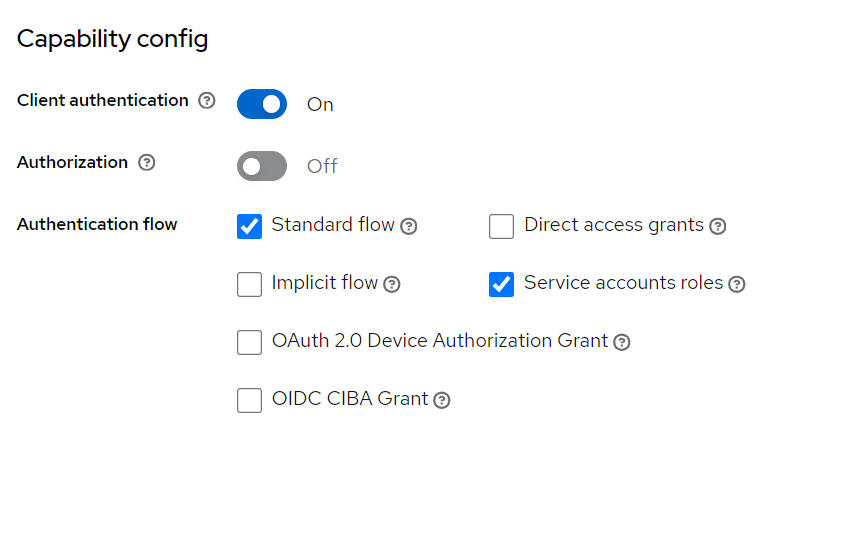
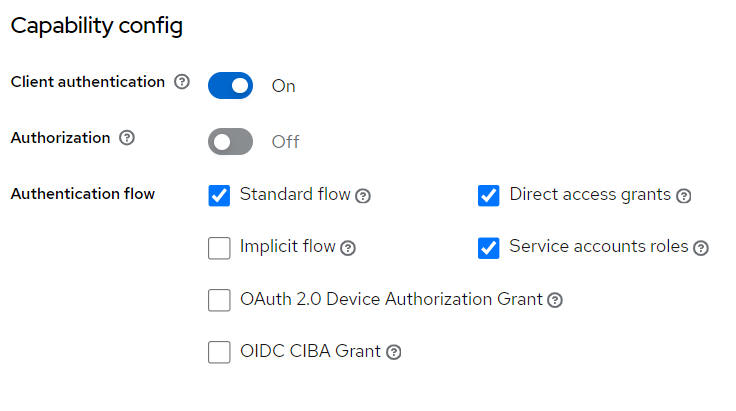
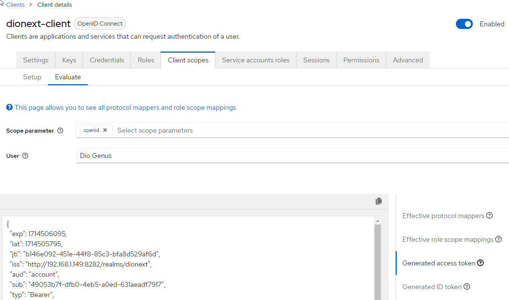


# {\#id1}Spring: Security

## Overview

Spring Security is a Java/Java EE framework that provides authentication, authorization and other security features for enterprise applications.

Spring Security is a powerful and highly customizable authentication and access-control framework. It is the de-facto standard for securing Spring-based applications. Spring Security is a framework that focuses on providing both authentication and authorization to Java applications. Like all Spring projects, the real power of Spring Security is found in how easily it can be extended to meet custom requirements

**Authentication** is the act of proving an assertion, such as the identity of a computer system user.

**Authorization** or authorisation is the function of specifying access rights/privileges to resources, which is related to general information security and computer security, and to access control in particular. More formally, "to authorize" is to define an access policy. For example, human resources staff are normally authorized to access employee records and this policy is often formalized as access control rules in a computer system. During operation, the system uses the access control rules to decide whether access requests from (authenticated) consumers shall be approved (granted) or disapproved (rejected). [https://en.wikipedia.org/wiki/Authorization](https://en.wikipedia.org/wiki/Authorization)

## Dependencies

```html
<dependency>
	<groupId>org.springframework.boot</groupId>
	<artifactId>spring-boot-starter-security</artifactId>
</dependency>
Basic
```

In the context of an HTTP transaction, basic access authentication is a method for an HTTP user agent (e.g. a web browser) to provide a user name and password when making a request. In basic HTTP authentication, a request contains a header field in the form of Authorization: Basic \<credentials\>, where \<credentials\> is the Base64 encoding of ID and password joined by a single colon :. [https://en.wikipedia.org/wiki/Basic\_access\_authentication](https://en.wikipedia.org/wiki/Basic_access_authentication)

User managment:

```java
    @Bean
    public InMemoryUserDetailsManager userDetailsService(PasswordEncoder passwordEncoder) {
        UserDetails user = User.withUsername("user")
                .password(passwordEncoder.encode("password"))
                .roles("USER")
                .build();

        UserDetails admin = User.withUsername("admin1")
                .password(passwordEncoder.encode("admin1"))
                .roles("USER", "ADMIN")
                .build();

        return new InMemoryUserDetailsManager(user, admin);
    }
    @Bean
    public PasswordEncoder passwordEncoder() {
        PasswordEncoder encoder = PasswordEncoderFactories.createDelegatingPasswordEncoder();
        return encoder;
    }
```

Basic filter:

```java
    @Bean
    public SecurityFilterChain actuatorSecurityFilterChain(HttpSecurity http) throws Exception {
        http.authorizeHttpRequests(authorizeHttpRequests -> authorizeHttpRequests
                 .requestMatchers(prefix + "/actuator/**").authenticated()
                        .anyRequest().permitAll());
        http.httpBasic(withDefaults())
             .formLogin(withDefaults())
             .csrf(AbstractHttpConfigurer::disable);
        return http.build();
    }
 
```

How to Solve 403 Error in Spring Boot POST Request [https://www.baeldung.com/java-spring-fix-403-error](https://www.baeldung.com/java-spring-fix-403-error)

Temporary disabling security (! not working in all cases):

```java
@SpringBootApplication(exclude = {SecurityAutoConfiguration.class, ManagementWebSecurityAutoConfiguration.class})
```

## OAuth, OAuth2, OpenID, OIDC

### Overview

**OAuth**(short for "Open Authorization") is an open standard for access delegation, commonly used as a way for internet users to grant websites or applications access to their information on other websites but without giving them the passwords. This mechanism is used by companies such as Amazon, Google, Meta Platforms, Microsoft, and Twitter to permit users to share information about their accounts with third-party applications or websites. Generally, the OAuth protocol provides a way for resource owners to provide a client \[application\] with secure delegated access to server resources. It specifies a process for resource owners to authorize third-party access to their server resources without providing credentials. Designed specifically to work with Hypertext Transfer Protocol (HTTP), OAuth essentially allows access tokens to be issued to third-party clients by an authorization server, with the approval of the resource owner. The third party then uses the access token to access the protected resources hosted by the resource server.

The **OAuth 2.0** framework was published considering additional use cases and extensibility requirements gathered from the wider IETF community. Albeit being built on the OAuth 1.0 deployment experience, OAuth 2.0 is not backwards compatible with OAuth 1.0. OAuth 2.0 was published as RFC 6749 and the Bearer Token Usage as RFC 6750, both standards track Requests for Comments, in October 2012

[https://en.wikipedia.org/wiki/OAuth](https://en.wikipedia.org/wiki/OAuth)

**OpenID** is an open standard and decentralized authentication protocol promoted by the non-profit OpenID Foundation. It allows users to be authenticated by co-operating sites (known as relying parties, or RP) using a third-party identity provider (IDP) service, eliminating the need for webmasters to provide their own ad hoc login systems, and allowing users to log in to multiple unrelated websites without having to have a separate identity and password for each. Users create accounts by selecting an OpenID identity provider, and then use those accounts to sign on to any website that accepts OpenID authentication. Several large organizations either issue or accept OpenIDs on their websites

**OpenID Connect (OIDC)** is the third generation of OpenID technology. It is an authentication layer on top of the OAuth 2.0 authorization framework. It allows computing clients to verify the identity of an end user based on the authentication performed by an authorization server, as well as to obtain the basic profile information about the end user in an interoperable and REST-like manner. In technical terms, OpenID Connect specifies a RESTful HTTP API, using JSON as a data format.

[https://en.wikipedia.org/wiki/OpenID](https://en.wikipedia.org/wiki/OpenID)

### Keycloak integration

#### Overview

Keycloak is an open source software product to allow single sign-on with identity and access management aimed at modern applications and services. Keycloak supports various protocols such as OpenID, OAuth version 2.0 and SAML and provides features such as user management, two-factor authentication, permissions and roles management, creating token services, etc. [https://en.wikipedia.org/wiki/Keycloak](https://en.wikipedia.org/wiki/Keycloak)

[https://www.keycloak.org/guides](https://www.keycloak.org/guides) Documentation on official website

#### Core concepts and terms {\#core-concepts-and-terms}

users

:   Users are entities that are able to log into your system. They can have attributes associated with themselves like email, username, address, phone number, and birthday. They can be assigned group membership and have specific roles assigned to them.

credentials

:   Credentials are pieces of data that Keycloak uses to verify the identity of a user. Some examples are passwords, one-time-passwords, digital certificates, or even fingerprints.

roles

:   Roles identify a type or category of user. Admin, user, manager, and employee are all typical roles that may exist in an organization. Applications often assign access and permissions to specific roles rather than individual users as dealing with users can be too fine-grained and hard to manage.

user role mapping

:   A user role mapping defines a mapping between a role and a user. A user can be associated with zero or more roles. This role mapping information can be encapsulated into tokens and assertions so that applications can decide access permissions on various resources they manage.

groups

:   Groups manage groups of users. Attributes can be defined for a group. You can map roles to a group as well. Users that become members of a group inherit the attributes and role mappings that group defines.

realms

:   A realm manages a set of users, credentials, roles, and groups. A user belongs to and logs into a realm. Realms are isolated from one another and can only manage and authenticate the users that they control.

clients

:   Clients are entities that can request Keycloak to authenticate a user. Most often, clients are applications and services that want to use Keycloak to secure themselves and provide a single sign-on solution. Clients can also be entities that just want to request identity information or an access token so that they can securely invoke other services on the network that are secured by Keycloak.

client scopes

:   When a client is registered, you must define protocol mappers and role scope mappings for that client. It is often useful to store a client scope, to make creating new clients easier by sharing some common settings. This is also useful for requesting some claims or roles to be conditionally based on the value of scope parameter. Keycloak provides the concept of a client scope for this.

client role

:   Clients can define roles that are specific to them. This is basically a role namespace dedicated to the client.

identity token

:   A token that provides identity information about the user. Part of the OpenID Connect specification.

access token

:   A token that can be provided as part of an HTTP request that grants access to the service being invoked on. This is part of the OpenID Connect and OAuth 2.0 specification.

direct grant

:   A way for a client to obtain an access token on behalf of a user via a REST invocation.

#### Dependencies

Client dependencies:

```html
<dependency>
    <groupId>org.springframework.boot</groupId>
    <artifactId>spring-boot-starter-oauth2-client</artifactId>
</dependency>
```

Server dependencies:

```html
<dependency>
    <groupId>org.springframework.boot</groupId>
    <artifactId>spring-boot-starter-oauth2-resource-server</artifactId>
</dependency>
```

#### Special keycloak settings

we need to set the Client Scopes properly so that KeyCloak passes all the roles for the authenticating user to the token. So we need to navigate to the Client Scopes page and then set microprofile-jwt to "default" , as shown in the picture below.


Important client settings:



Direct access grant for entrance with grant\_type=client\_credentials



How to see token details



Alternate: use online tool - [https://jwt.io/](https://jwt.io/) JWT.IO allows you to decode, verify and generate JWT

Token details example (with given role "DIONEXT"):

```json
		
{
  "exp": 1714506095,
  "iat": 1714505795,
  "jti": "b146e092-451e-44f8-85c3-bfa8d529af6d",
  "iss": "http://192.168.1.149:8282/realms/dionext",
  "aud": "account",
  "sub": "49053b7f-dfb0-4eb5-a0ed-631aeadf7917",
  "typ": "Bearer",
  "azp": "dionext-client",
  "session_state": "f677d4cc-8a08-4c89-8649-03f64acd0e4d",
  "acr": "1",
  "realm_access": {
    "roles": [
      "offline_access",
      "DIONEXT",
      "default-roles-dionext",
      "uma_authorization"
    ]
  },
  "resource_access": {
    "account": {
      "roles": [
        "manage-account",
        "manage-account-links",
        "view-profile"
      ]
    }
  },
  "scope": "openid microprofile-jwt email profile dionext-scope",
  "sid": "f677d4cc-8a08-4c89-8649-03f64acd0e4d",
  "upn": "dionext-user",
  "email_verified": false,
  "name": "dionext-user",
  "groups": [
    "offline_access",
    "DIONEXT",
    "default-roles-dionext",
    "uma_authorization"
  ],
  "preferred_username": "dionext-user",
  "given_name": "Dio",
  "family_name": "Genus"
}		
		
```

Curl examples:

```
curl --location 'http://192.168.1.149:8282/realms/dionext/protocol/openid-connect/token' \
--header 'Content-Type: application/x-www-form-urlencoded' \
--data-urlencode 'client_id=dionext-client' \
--data-urlencode 'client_secret=OXqaLvZV4aDfbmn4w6Kvk6tIXRBTCDPZ' \
--data-urlencode 'grant_type=client_credentials'
```

```
curl --location 'http://192.168.1.149:8282/realms/dionext/protocol/openid-connect/token' \
--header 'Content-Type: application/x-www-form-urlencoded' \
--data-urlencode 'client_id=dionext-client' \
--data-urlencode 'client_secret=OXqaLvZV4aDfbmn4w6Kvk6tIXRBTCDPZ' \
--data-urlencode 'grant_type=password' \
--data-urlencode 'username=dionext-user' \
--data-urlencode 'password=dionext-user'
```

Spring with both oauth2Login and Basic authentication - is it possible? There is some solution: [https://stackoverflow.com/questions/76989057/spring-with-both-oauth2login-and-basic-authentication](https://stackoverflow.com/questions/76989057/spring-with-both-oauth2login-and-basic-authentication) But we were unable to apply it successfully.

#### Keycloak references

[https://keycloak.ch/keycloak-tutorials/](https://keycloak.ch/keycloak-tutorials/) Free Keycloak tutorials

[https://www.baeldung.com/spring-boot-keycloak](https://www.baeldung.com/spring-boot-keycloak) A Quick Guide to Using Keycloak With Spring Boot

[https://habr.com/ru/articles/716232/](https://habr.com/ru/articles/716232/) Example (ru)

## References

[https://docs.spring.io/spring-security/reference/servlet/authorization/authorize-http-requests.html](https://docs.spring.io/spring-security/reference/servlet/authorization/authorize-http-requests.html)

[https://docs.spring.io/spring-security/reference/servlet/authentication/passwords/form.html](https://docs.spring.io/spring-security/reference/servlet/authentication/passwords/form.html)

[https://www.codejava.net/frameworks/spring-boot/multiple-login-pages-examples](https://www.codejava.net/frameworks/spring-boot/multiple-login-pages-examples) Spring Security Multiple Login Pages Examples
