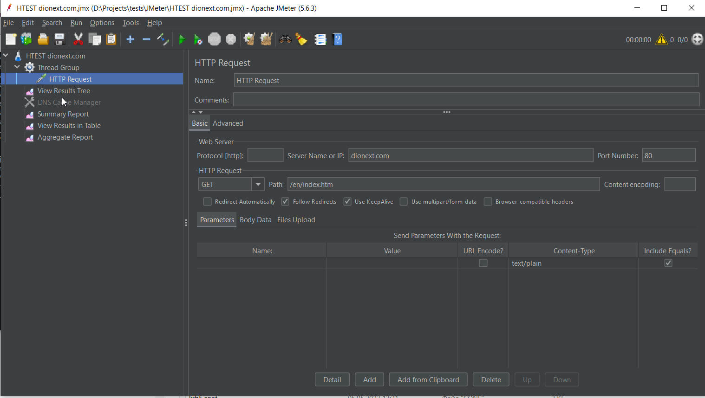


# Testing and debugging

## Unit testing

### Using Active profile for testing

```java

@SpringBootTest
@ActiveProfiles(value = "test")
class HikiMsAppApplicationTests {
//...
}
```

[https://www.baeldung.com/spring-boot-junit-5-testing-active-profile](https://www.baeldung.com/spring-boot-junit-5-testing-active-profile) Execute Tests Based on Active Profile With JUnit 5

### Using In-Memory Database

When programming integration tests, you may encounter a problem connecting to the database. Integration tests assume that your application should run normally. However, if the application uses a database, the connection to the database should be successful. If you always run integration tests in the same environment, then this will not be a big problem for you. The database must be accessible in your environment one way or another, otherwise you wouldn't be able to debug your application. Accordingly, the database will also be available during the launch of the integration test. However, if you want the integration test to be able to run successfully in any environment (for example, during the execution of a CI/CD pipeline), then you can no longer expect that your database will still be accessible from this new environment. In this case, you will need to take care of replacing the database in advance. Typically, In-Memory Database is used for these purposes.

Maven Dependencies

```xml

        <!-- dependencies for database-->
        <dependency>
            <groupId>org.springframework.boot</groupId>
            <artifactId>spring-boot-starter-validation</artifactId>
        </dependency>
        <dependency>
            <groupId>org.springframework.boot</groupId>
            <artifactId>spring-boot-starter-data-jpa</artifactId>
        </dependency>
        <dependency>
            <groupId>org.mariadb.jdbc</groupId>
            <artifactId>mariadb-java-client</artifactId>
            <version>3.3.2</version>
        </dependency>
        <dependency>
            <groupId>com.zaxxer</groupId>
            <artifactId>HikariCP</artifactId>
            <version>5.1.0</version>
        </dependency>
        <dependency><!-- for unit testing -->
            <groupId>com.h2database</groupId>
            <artifactId>h2</artifactId>
            <version>2.1.214</version>
        </dependency>
```

In application-test.yaml

```yaml

spring:
  datasource:
    url: jdbc:h2:mem:myDb;DB_CLOSE_DELAY=-1;NON_KEYWORDS=KEY,VALUE
    #driverClassName: org.h2.Driver
  jpa:
    hibernate:
      dialect: org.hibernate.dialect.H2Dialect
      hbm2ddl:
        auto: create
```

Self-Contained Testing Using an In-Memory Database [https://www.baeldung.com/spring-jpa-test-in-memory-database](https://www.baeldung.com/spring-jpa-test-in-memory-database)

## JMeter

[https://jmeter.apache.org/](https://jmeter.apache.org/)

The Apache JMeter™ application is open source software, a 100% pure Java application designed to load test functional behavior and measure performance. It was originally designed for testing Web Applications but has since expanded to other test functions.

Monitor your website using JMeter [https://developer.ibm.com/tutorials/monitor-your-website-using-jmeter/](https://developer.ibm.com/tutorials/monitor-your-website-using-jmeter/)

Using you own hosts table [https://jmeter.apache.org/usermanual/component\_reference.html#DNS\_Cache\_Manager](https://jmeter.apache.org/usermanual/component_reference.html#DNS_Cache_Manager)



## Selenium

[https://www.selenium.dev/](https://www.selenium.dev/)

Selenium is an open source umbrella project for a range of tools and libraries aimed at supporting browser automation. It provides a playback tool for authoring functional tests across most modern web browsers, without the need to learn a test scripting language (Selenium IDE). It also provides a test domain-specific language (Selenese) to write tests in a number of popular programming languages, including JavaScript (Node.js), C#, Groovy, Java, Perl, PHP, Python, Ruby and Scala. Selenium runs on Windows, Linux, and macOS. It is open-source software released under the Apache License 2.0 [https://en.wikipedia.org/wiki/Selenium\_(software](<https://en.wikipedia.org/wiki/Selenium_(software>))
