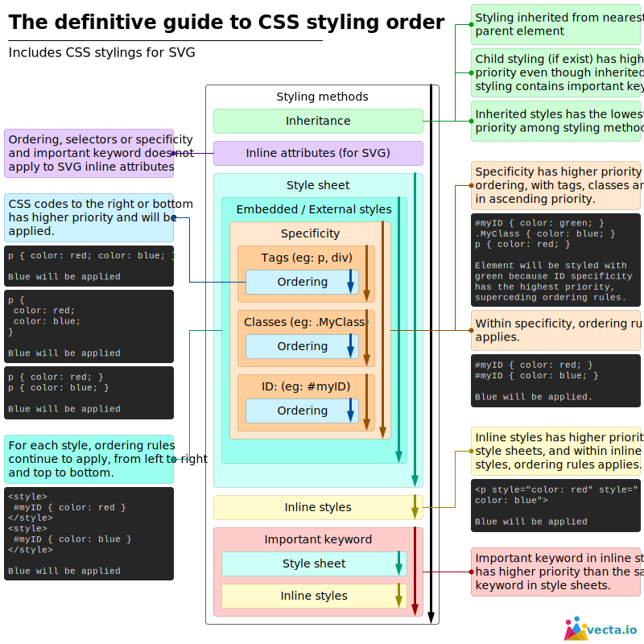


## CSS

## Overview

Cascading Style Sheets (CSS) is a style sheet language used for specifying the presentation and styling of a document written in a markup language such as HTML or XML (including XML dialects such as SVG, MathML or XHTML). CSS is a cornerstone technology of the World Wide Web, alongside HTML and JavaScript. CSS is designed to enable the separation of content and presentation, including layout, colors, and fonts.  
This separation can improve content accessibility;\[further explanation needed\] provide more flexibility and control in the specification of presentation characteristics; enable multiple web pages to share formatting by specifying the relevant CSS in a separate .css file, which reduces complexity and repetition in the structural content; and enable the .css file to be cached to improve the page load speed between the pages that share the file and its formatting. [https://en.wikipedia.org/wiki/CSS](https://en.wikipedia.org/wiki/CSS)

## Tutorials, guides, reference books

For beginers [https://www.w3.org/Style/Examples/011/firstcss](https://www.w3.org/Style/Examples/011/firstcss) CSS tutorial starting with HTML + CSS

[https://www.w3schools.com/css/](https://www.w3schools.com/css/) CSS Tutorial

[https://cssreference.io/](https://cssreference.io/) A free visual guide to CSS. It features the most popular properties, and explains them with illustrated and animated examples.

[https://tympanus.net/codrops/css\_reference/](https://tympanus.net/codrops/css_reference/) CSS Reference. An extensive CSS reference with all the important properties and info to learn CSS from the basics

[List of CSS properties,](http://meiert.com/en/indices/css-properties/) including those in working drafts, with links to the relevant specifications (by Jens Meiert).

[https://www.cssportal.com/](https://www.cssportal.com/) CSS Portal is home to many examples of CSS / HTML and how it can be used in website design. Here you'll find all CSS properties and many CSS generators to help with all your design needs.

[https://www.cssportal.com/css-color-converter/](https://www.cssportal.com/css-color-converter/)

[https://www.cssportal.com/css-font-preview/](https://www.cssportal.com/css-font-preview/)

[https://www.cssportal.com/css-style-editor/](https://www.cssportal.com/css-style-editor/)

[https://www.cssportal.com/css-formatter/](https://www.cssportal.com/css-formatter/) [https://www.cssportal.com/css-optimize/](https://www.cssportal.com/css-optimize/) [https://www.cssportal.com/css-validator/](https://www.cssportal.com/css-validator/)

[https://www.cssportal.com/image-to-data/](https://www.cssportal.com/image-to-data/) The Data URI Generator will produce base64 encoded data from an image file. This data can then be used in your CSS files which saves the browser from having to make additional HTTP requests for the external resources, and can therefore increase page loading speed.

## Summary

Summary of selector syntax (from [https://en.wikipedia.org/wiki/CSS](https://en.wikipedia.org/wiki/CSS) )

{#mwuQ}{#mwwA}{#mwyA}{#mw0A}{#mw2A}{#mw4A}{#mw5w}{#mw7g}{#mw9g}{#mw\_g}{#mwAQc}{#mwAQ8}{#mwARU}{#mwAR4}{#mwASk}{#mwATQ}{#mwAUM}{#mwAUs}{#mwAVY}{#mwAV4}{#mwAWY}{#mwAXA}{#mwAXo}{#mwAYU}{#mwAZA0}{#mwAZs0}{#mwAaM}{#mwAa4}{#mwAbk}{#mwAcQ}{#mwAc8}{#mwAdc}{#mwAd8}{#mwAec}{#mwAe8}{#mwAfc}{#mwAf8}{#mwAgc}{#mwAg8}{#mwAhc}{#mwAh8}{#mwAio}{#mwAjQ}{#mwtQ}

|             Pattern              |                                                              Matches                                                               | First defined in CSS level |
|----------------------------------|------------------------------------------------------------------------------------------------------------------------------------|----------------------------|
| ` `E                             | an element of type E                                                                                                               | 1                          |
| ` `E:link                        | an E element that is the source anchor of a hyperlink whose target is either not yet visited (:link) or already visited (:visited) | 1                          |
| ` `E:active                      | an E element during certain user actions                                                                                           | 1                          |
| ` `E::first-line                 | the first formatted line of an E element                                                                                           | 1                          |
| ` `E::first-letter               | the first formatted letter of an E element                                                                                         | 1                          |
| ` `.c                            | all elements with class="c"                                                                                                        | 1                          |
| ` `#myid                         | the element with id="myid"                                                                                                         | 1                          |
| ` `E.warning                     | an E element whose class is "warning" (the document language specifies how class is determined)                                    | 1                          |
| ` `E#myid                        | an E element with ID equal to "myid"                                                                                               | 1                          |
| ` `.c#myid                       | the element with class="c" and ID equal to "myid"                                                                                  | 1                          |
| ` `E F                           | an F element descendant of an E element                                                                                            | 1                          |
| ` `\*                             | any element                                                                                                                        | 2                          |
| ` `E\[foo\]                        | an E element with a "foo" attribute                                                                                                | 2                          |
| ` `E\[foo="bar"\]                  | an E element whose "foo" attribute value is exactly equal to "bar"                                                                 | 2                          |
| ` `E\[foo~="bar"\]                 | an E element whose "foo" attribute value is a list of whitespace-separated values, one of which is exactly equal to "bar"          | 2                          |
| ` `E<nowiki>\[foo|="en"\]</nowiki> | an E element whose "foo" attribute has a hyphen-separated list of values beginning (from the left) with "en"                       | 2                          |
| ` `E:first-child                 | an E element, first child of its parent                                                                                            | 2                          |
| ` `E:lang(fr)                    | an element of type E in language "fr" (the document language specifies how language is determined)                                 | 2                          |
| ` `E::before                     | generated content before an E element's content                                                                                    | 2                          |
| ` `E::after                      | generated content after an E element's content                                                                                     | 2                          |
| ` `E \> F                         | an F element child of an E element                                                                                                 | 2                          |
| ` `E + F                         | an F element immediately preceded by an E element                                                                                  | 2                          |
| ` `E\[foo^="bar"\]                 | an E element whose "foo" attribute value begins exactly with the string "bar"                                                      | 3                          |
| ` `E\[foo$="bar"\]                 | an E element whose "foo" attribute value ends exactly with the string "bar"                                                        | 3                          |
| ` `E\[foo\*="bar"\]                 | an E element whose "foo" attribute value contains the substring "bar"                                                              | 3                          |
| ` `E:root                        | an E element, root of the document                                                                                                 | 3                          |
| ` `E:nth-child(n)                | an E element, the n-th child of its parent                                                                                         | 3                          |
| ` `E:nth-last-child(n)           | an E element, the n-th child of its parent, counting from the last one                                                             | 3                          |
| ` `E:nth-of-type(n)              | an E element, the n-th sibling of its type                                                                                         | 3                          |
| ` `E:nth-last-of-type(n)         | an E element, the n-th sibling of its type, counting from the last one                                                             | 3                          |
| ` `E:last-child                  | an E element, last child of its parent                                                                                             | 3                          |
| ` `E:first-of-type               | an E element, first sibling of its type                                                                                            | 3                          |
| ` `E:last-of-type                | an E element, last sibling of its type                                                                                             | 3                          |
| ` `E:only-child                  | an E element, only child of its parent                                                                                             | 3                          |
| ` `E:only-of-type                | an E element, only sibling of its type                                                                                             | 3                          |
| ` `E:empty                       | an E element that has no children (including text nodes)                                                                           | 3                          |
| ` `E:target                      | an E element being the target of the referring URI                                                                                 | 3                          |
| ` `E:enabled                     | a user interface element E that is enabled                                                                                         | 3                          |
| ` `E:disabled                    | a user interface element E that is disabled                                                                                        | 3                          |
| ` `E:checked                     | a user interface element E that is checked (for instance a radio button or checkbox)                                               | 3                          |
| ` `E:not(s)                      | an E element that does not match simple selector s                                                                                 | 3                          |
| ` `E ~ F                         | an F element preceded by an E element                                                                                              | 3                          |

{#mwtA}

## Priority of style

[https://www.w3schools.com/css/css\_specificity.asp](https://www.w3schools.com/css/css_specificity.asp) CSS Specificity

{#mwAzY}{#mwAzo}{#mwA0E}{#mwA0U}{#mwA0k}{#mwA00}{#mwA1Y}{#mwA1o}{#mwA14}{#mwA2I}{#mwAzI}

| Priority |             CSS source type              |                                         Description                                          |
|----------|------------------------------------------|----------------------------------------------------------------------------------------------|
| 1        | Importance                               | The "!important{#mwAz0}" annotation overwrites the previous priority types                   |
| 2        | Inline                                   | A style applied to an HTML element via HTML "style" attribute                                |
| 3        | Media Type                               | A property definition applies to all media types unless a media-specific CSS is defined      |
| 4        | User defined                             | Most browsers have the accessibility feature: a user-defined CSS                             |
| 5        | Selector specificity                     | A specific contextual selector (#heading p{#mwA1I}) overwrites generic definition            |
| 6        | Rule order                               | Last rule declaration has a higher priority                                                  |
| 7        | Parent inheritance                       | If a property is not specified, it is inherited from a parent element                        |
| 8        | CSS property definition in HTML document | CSS rule or CSS inline style overwrites a default browser value                              |
| 9        | Browser default                          | The lowest priority: browser default value is determined by W3C initial value specifications |

{#mwAzA}

[https://vecta.io/blog/definitive-guide-to-css-styling-order](https://vecta.io/blog/definitive-guide-to-css-styling-order) Having a diagram helps us visualize how everything is ordered in terms of priority, and hopefully it has helped you too! [https://css-tricks.com/the-c-in-css-the-cascade/](https://css-tricks.com/the-c-in-css-the-cascade/)

## Background

[https://developer.mozilla.org/en-US/docs/Web/CSS/background-size](https://developer.mozilla.org/en-US/docs/Web/CSS/background-size)

[https://developer.mozilla.org/en-US/docs/Web/CSS/CSS\_Backgrounds\_and\_Borders/Using\_multiple\_backgrounds](https://developer.mozilla.org/en-US/docs/Web/CSS/CSS_Backgrounds_and_Borders/Using_multiple_backgrounds)

## References
